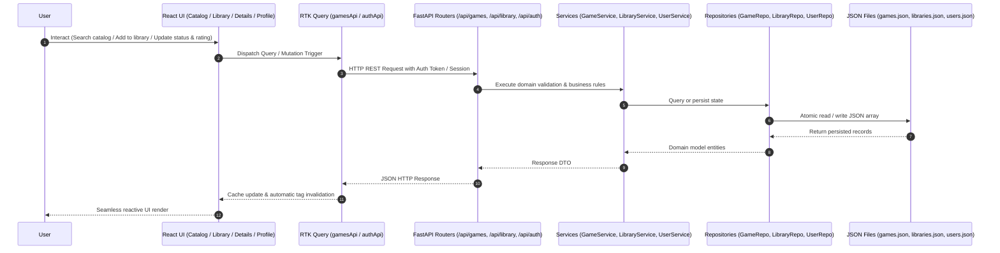
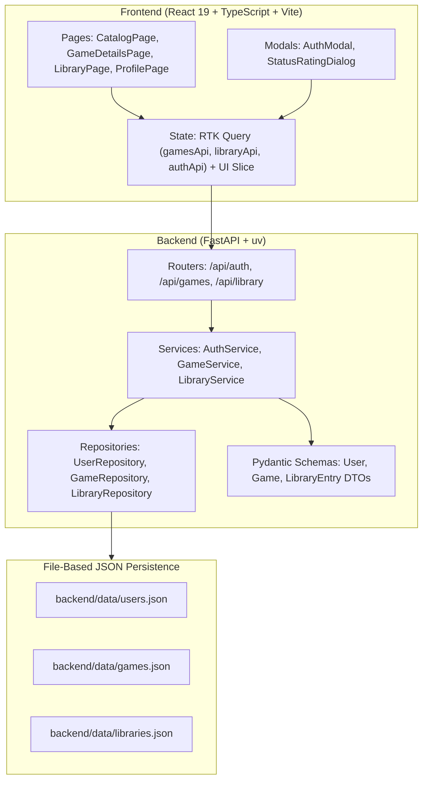

# GameLibrary — Architecture

## 1. System Overview

GameLibrary is designed as a unified full-stack vertical application consisting of a **React 19 + TypeScript** SPA and a **FastAPI** backend with file-based JSON storage.



---

## 2. Full-Stack Component Architecture

The application is structured into cohesive layers where each layer handles specific responsibilities across the entire stack:



### 2.1 Layer Responsibilities

| Layer | Responsibility | Location |
|-------|----------------|----------|
| **UI Components & Pages** | Render views (Catalog, Game Details, My Library, Profile), user input, and navigation | `frontend/src/features/games/` |
| **Client State & API** | RTK Query endpoints, optimistic updates, query caching, and cache tag invalidation | `frontend/src/store/api/`, `frontend/src/store/slices/` |
| **API Routers** | HTTP routing, request parameter binding, status codes, dependency injection of services | `backend/app/routers/` (`games.py`, `library.py`, `auth.py`) |
| **Domain Services** | Business logic (duplicate checks, status transitions, rating range validation, statistics computation) | `backend/app/services/` (`game_service.py`, `library_service.py`, `user_service.py`) |
| **Repositories** | Atomic read/write operations on JSON storage, entity filtering, tenant-isolated lookups | `backend/app/repositories/` (`game_repository.py`, `library_repository.py`, `user_repository.py`) |
| **Data Models** | Pydantic v2 schemas for request validation, domain entities, and response serialization | `backend/app/models/` (`game.py`, `library.py`, `user.py`) |
| **Data Storage** | File-based JSON arrays storing persistent domain data | `backend/data/` (`games.json`, `libraries.json`, `users.json`) |

---

## 3. Data Storage & Schema Design

Data is persisted as JSON arrays in dedicated files under `backend/data/`. This enables zero-friction setup without external database dependencies while upholding strict domain boundaries.

### 3.1 `games.json`
Stores the global game catalog:
```json
[
  {
    "id": "c1f73b64-88a2-4a0b-9689-53e7f4c54780",
    "title": "The Witcher 3: Wild Hunt",
    "description": "An open-world RPG set in a dark fantasy universe.",
    "cover_image": "https://images.example.com/witcher3.jpg",
    "genres": ["RPG", "Action"],
    "platforms": ["PC", "PlayStation", "Xbox", "Nintendo Switch"],
    "release_year": 2015,
    "developer": "CD Projekt Red"
  }
]
```

### 3.2 `libraries.json`
Stores user library entries (associations between users and games):
```json
[
  {
    "id": "e2a531b8-6549-4eb5-8e77-5f33ef52fbf2",
    "user_id": "a901e1d3-3fb9-4f76-9311-bf3f45f7c320",
    "game_id": "c1f73b64-88a2-4a0b-9689-53e7f4c54780",
    "status": "playing",
    "rating": 9,
    "created_at": "2026-09-22T10:00:00Z",
    "updated_at": "2026-09-22T10:15:00Z"
  }
]
```

### 3.3 `users.json`
Stores registered user credentials:
```json
[
  {
    "id": "a901e1d3-3fb9-4f76-9311-bf3f45f7c320",
    "username": "gamer123",
    "email": "gamer@example.com",
    "hashed_password": "$2b$12$e...",
    "created_at": "2026-09-22T09:30:00Z"
  }
]
```

---

## 4. API Surface & Contract

| Endpoint | Method | Auth Required | Request Body | Status | Description |
|----------|--------|---------------|--------------|--------|-------------|
| `/api/auth/register` | `POST` | No | `UserRegisterRequest` (`username`, `email`, `password`) | `201 Created`<br>`409 Conflict`<br>`422 Unprocessable` | Register new user account |
| `/api/auth/login` | `POST` | No | `UserLoginRequest` (`email`, `password`) | `200 OK`<br>`401 Unauthorized` | Authenticate user & return session/token |
| `/api/auth/me` | `GET` | Yes | None | `200 OK`<br>`401 Unauthorized` | Return current authenticated user profile |
| `/api/games` | `GET` | No | Query: `search?`, `genre?`, `platform?`, `sort?` | `200 OK` | List catalog games with search/filter |
| `/api/games/{id}` | `GET` | No | None | `200 OK`<br>`404 Not Found` | Get detailed information for a single game |
| `/api/library` | `GET` | Yes | Query: `status?` | `200 OK`<br>`401 Unauthorized` | List authenticated user's library games |
| `/api/library` | `POST` | Yes | `AddLibraryEntryRequest` (`game_id`) | `201 Created`<br>`400 Conflict`<br>`404 Not Found` | Add game to personal library (default "want_to_play") |
| `/api/library/{id}` | `PATCH` | Yes | `UpdateLibraryEntryRequest` (`status?`, `rating?`) | `200 OK`<br>`404 Not Found`<br>`422 Unprocessable` | Update play status or rating |
| `/api/library/{id}` | `DELETE` | Yes | None | `204 No Content`<br>`404 Not Found` | Remove game from personal library |
| `/api/users/me/stats` | `GET` | Yes | None | `200 OK`<br>`401 Unauthorized` | Retrieve calculated statistics for current user |

---

## 5. State Management & Cache Invalidation

RTK Query provides automated caching and UI synchronization via entity tags:

- **Tags**:
  - `Game`: Cached catalog queries (`{ type: 'Game', id: 'LIST' }`, `{ type: 'Game', id }`).
  - `Library`: User personal library cache (`{ type: 'Library', id: 'LIST' }`, `{ type: 'Library', id }`).
  - `Stats`: User profile statistics (`{ type: 'Stats', id: 'CURRENT' }`).
  - `Auth`: Current session state.
- **Cache Synchronization Rules**:
  - Adding a game to library invalidates `Library` and `Stats` tags $\rightarrow$ My Library and Profile immediately refresh.
  - Updating status or rating invalidates specific `Library` entry and `Stats` $\rightarrow$ counts and badges update instantly.
  - Removing a game from library invalidates `Library` and `Stats` tags.
  - Logging in / out invalidates all user-scoped caches and resets state.

