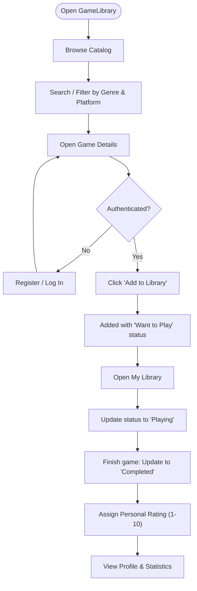

# GameLibrary — Business Requirements

## 1. General Information

- **Project Name**: GameLibrary
- **Project Type**: Web Application
- **Version**: 1.0
- **Status**: Draft / MVP

### 1.1 Project Description

GameLibrary is a web application for managing a personal video game library. The system allows users to browse a catalog of video games, search for games, filter the catalog, and add games to their personal library. For each added game, the user can set a play status and a personal rating.

The main goal of the project is to provide users with a simple tool for organizing their video game library and tracking their gaming progress.

---

## 2. Business Goals

- Provide users with a single place to store information about games they want to play, are currently playing, or have already completed.
- Allow users to quickly find games by title, genre, and platform.
- Allow users to track the play status of each game.
- Provide users with the ability to rate completed games.
- Display basic statistics about the user's game library.
- Create a simple and intuitive web interface that does not require any special skills.

---

## 3. Problem Statement

Users who own a large number of video games often struggle to remember:
- Which games they have already completed.
- Which games they plan to play.
- Which games they are currently playing.
- Which games they liked and how they rated them.
- Which games they would like to add to their library.

GameLibrary addresses this problem by providing a personal library where users can organize their games by status and rating.

---

## 4. Project Scope

### 4.1 In Scope

- User registration and account creation.
- User authentication (login/logout).
- Browsing the global game catalog.
- Game search by title.
- Filtering catalog by genre and platform (single or combined filters).
- Viewing detailed game information.
- Adding games to personal library (with default "Want to Play" status).
- Removing games from personal library.
- Changing game play status ("Want to Play", "Playing", "Completed").
- Rating games with a personal score (1–10).
- Viewing and filtering personal library by status.
- User profile with automatic library statistics calculation.

### 4.2 Out of Scope

- Game purchases and online payments.
- Third-party integrations (Steam, PlayStation Network, Xbox Network, etc.).
- Chat, messaging, or social friends system.
- Achievements and automatic retrieval of gaming statistics.
- AI-powered game recommendations.
- User comments and community discussions.
- Native mobile applications (responsive web only).
- Administration panel.

---

## 5. Target Users & Permissions

| User Role | Description | Capabilities | Restrictions |
|-----------|-------------|--------------|--------------|
| **Unauthenticated Visitor** | Public guest user | - Browse game catalog - Search & filter games - View game details - Register and log in | - Cannot add games to library - Cannot rate games - Cannot view or access personal library or profile |
| **Authenticated User** | Registered member | - All guest capabilities - Add games to personal library - Update play status and personal ratings - Remove games from library - View personal library & profile statistics | - Cannot view or edit another user's private library - Cannot delete games from the global catalog |

---

## 6. Main System Pages

### 6.1 Catalog
The primary public entry point for browsing games.
- Grid/list display of catalog games with title, cover image, genre, platforms, and release year.
- Search input for real-time or submitted title queries.
- Filter dropdowns/pills for genre and platform.
- Sorting options (e.g., release year, title).
- Clickable cards navigating to the respective Game Details page.

### 6.2 Game Details
Dedicated view providing comprehensive details for a single game:
- Title, cover image, description, developer, release date, genres, and supported platforms.
- Action button: **"Add to Library"** (available to authenticated users; prompts unauthenticated visitors to log in).
- If already in user library: displays current play status, personal rating, options to modify status/rating, and **"Remove from Library"** button.

### 6.3 My Library
Authenticated user's personal game collection:
- Status tabs / filter pills: **All**, **Want to Play**, **Playing**, **Completed**.
- Game cards showing title, cover image, current status badge, and user rating.
- Controls to update status, update rating (1–10), remove from library, or open game details.
- Empty states with call-to-action to browse the catalog when no games match the active filter.

### 6.4 Profile
Personal dashboard displaying user statistics:
- Username and email.
- Total games in library.
- Count of games in **Want to Play**.
- Count of games currently **Playing**.
- Count of **Completed** games.
- Average personal rating across rated games.

---

## 7. Functional Requirements

All functional requirements describe end-to-end capabilities across the application:

| ID | Title | Description |
|----|-------|-------------|
| **FR-01** | Registration | The system shall allow a new user to create an account by providing username, email, and password. The system verifies that email and username are unique and not already registered. |
| **FR-02** | Authentication | The system shall allow registered users to log in using their email and password, granting access to their personal library and profile, and log out securely. |
| **FR-03** | Browse Catalog | The system shall display a catalog of available video games showing title, cover image, genre, platforms, and release year. |
| **FR-04** | Search | The user shall be able to search for games by title. If no matching games are found, the system displays "No games found." |
| **FR-05** | Filtering | The user shall be able to filter the catalog by genre and platform, supporting single or multiple concurrent filter criteria. |
| **FR-06** | View Game Information | When selecting a game, the system displays detailed game information: title, description, cover image, genre, platforms, release date, and developer. |
| **FR-07** | Add Game to Library | An authenticated user shall be able to add a game to their personal library. The initial status automatically defaults to "Want to Play". Duplicate additions of the same game are blocked. |
| **FR-08** | Change Game Status | The user shall be able to change the status of a library game to any of: "Want to Play", "Playing", or "Completed". |
| **FR-09** | Rate Game | An authenticated user may assign an optional personal rating from 1 to 10 to any game in their library and modify this rating at any time. |
| **FR-10** | Remove Game | The user shall be able to remove a game from their personal library. Removing a game from a user library does not delete it from the global catalog. |
| **FR-11** | View Library | The system shall display only the authenticated user's games. The user can filter their library by status: "All", "Want to Play", "Playing", and "Completed". |
| **FR-12** | Profile & Statistics | The system shall automatically calculate and display user statistics: total games, count per status ("Want to Play", "Playing", "Completed"), and average personal rating. |

---

## 8. Business Rules

- **BR-01**: Each user possesses an isolated, private personal library.
- **BR-02**: A game may be added to a user's library only once (unique `(user_id, game_id)`).
- **BR-03**: The status of a newly added game is automatically set to **"Want to Play"**.
- **BR-04**: A user may have exactly one status per game in their library at any given time.
- **BR-05**: Game ratings must be an integer between 1 and 10 inclusive.
- **BR-06**: Ratings are completely optional.
- **BR-07**: The user may change a game's status or rating at any time without restriction.
- **BR-08**: Removing a game from a user's library never deletes or mutates the game in the global catalog.
- **BR-09**: Unauthenticated users cannot view, create, or mutate personal library entries.
- **BR-10**: A user cannot view, modify, or delete another user's library data.

---

## 9. User Stories & Acceptance Criteria

### US-01 — Browse Catalog
- **As a** visitor
- **I want to** browse the game catalog
- **So that** I can discover games that interest me.
- **Acceptance Criteria**:
  1. The catalog displays all available games with cover image, title, genre, platforms, and release year.
  2. Clicking a game navigates to its Game Details page.

### US-02 — Search for a Game
- **As a** user
- **I want to** search for a game by title
- **So that** I can quickly find a specific game.
- **Acceptance Criteria**:
  1. Entering text into the search input dynamically filters results to matching titles.
  2. When no games match the query, the message "No games found." is displayed.

### US-03 — Add a Game to Library
- **As an** authenticated user
- **I want to** add a game to my personal library
- **So that** I can track my interest and progress.
- **Acceptance Criteria**:
  1. The "Add to Library" button is accessible on the game card and Game Details page for logged-in users.
  2. After addition, the game appears in "My Library" with status set to "Want to Play".
  3. The system prevents duplicate additions of the same game.

### US-04 — Change Play Status
- **As a** user
- **I want to** update the play status of a game in my library
- **So that** my library reflects my current gaming progress.
- **Acceptance Criteria**:
  1. Three valid statuses are available: "Want to Play", "Playing", "Completed".
  2. The user can switch status directly from My Library or the Game Details page.
  3. The updated status persists and immediately updates library filters and counters.

### US-05 — Rate a Game
- **As a** user
- **I want to** rate a game from 1 to 10
- **So that** I can record my personal opinion about it.
- **Acceptance Criteria**:
  1. Rating input accepts integers between 1 and 10.
  2. The rating can be updated or cleared at any time.
  3. Rating is optional and does not block changing status.

### US-06 — View and Filter Library
- **As a** user
- **I want to** view my games grouped or filtered by status
- **So that** I can manage my gaming backlog and completed achievements.
- **Acceptance Criteria**:
  1. Only the current user's games are displayed.
  2. Filter tabs ("All", "Want to Play", "Playing", "Completed") accurately isolate games.
  3. Current status and rating (if set) are prominently shown on each game card.

---

## 10. Non-Functional Requirements

- **NFR-01. Usability**: Simple, responsive, and intuitive interface requiring no onboarding or prior training. Core actions (search, filter, add to library, update status) are accessible in 1–2 clicks.
- **NFR-02. Performance**: Fast catalog loading and instantaneous client-side filtering and status toggles under expected MVP data volumes.
- **NFR-03. Security**: Passwords hashed securely (never stored in plain text). Strict authorization ensuring complete tenant isolation of user library data.
- **NFR-04. Browser Compatibility**: Full functional and visual compatibility across modern browsers: Google Chrome, Mozilla Firefox, Microsoft Edge, Safari.
- **NFR-05. Responsive Design**: Fluid layouts optimized for desktop, tablet, and mobile viewport sizes.

---

## 11. Main User Flow

---

## 12. Data Entities & Attributes

### 12.1 Game (Catalog)
- `id`: Stable string identifier (UUID).
- `title`: String, required.
- `description`: String, detailed overview.
- `cover_image`: String URL / asset path.
- `genres`: Array of strings (e.g., `["RPG", "Action"]`).
- `platforms`: Array of strings (e.g., `["PC", "PlayStation", "Xbox", "Nintendo Switch"]`).
- `release_date`: String (ISO date format) / `release_year` (integer).
- `developer`: String (e.g., `"CD Projekt Red"`).

### 12.2 Library Entry (User Game)
- `id`: Stable string identifier (UUID).
- `user_id`: UUID referencing the user.
- `game_id`: UUID referencing the game.
- `status`: Enum (`"want_to_play"` | `"playing"` | `"completed"`). Default: `"want_to_play"`.
- `rating`: Optional integer (1 to 10).
- `created_at`: ISO 8601 UTC timestamp.
- `updated_at`: ISO 8601 UTC timestamp.

### 12.3 User Account
- `id`: Stable string identifier (UUID).
- `username`: Unique string.
- `email`: Unique string, validated format.
- `hashed_password`: Securely hashed password string.
- `created_at`: ISO 8601 UTC timestamp.

---

## 13. Project Success Criteria

The MVP is considered successful when an end user can seamlessly execute the complete lifecycle flow:
1. Register and log in.
2. Search and filter games in the global catalog.
3. Open game details and add games to their personal library.
4. Update play status from "Want to Play" $\rightarrow$ "Playing" $\rightarrow$ "Completed".
5. Submit and update personal ratings (1–10).
6. View filtered personal library and accurate profile statistics.
7. Data persists reliably across application restarts and page refreshes with full user isolation.

